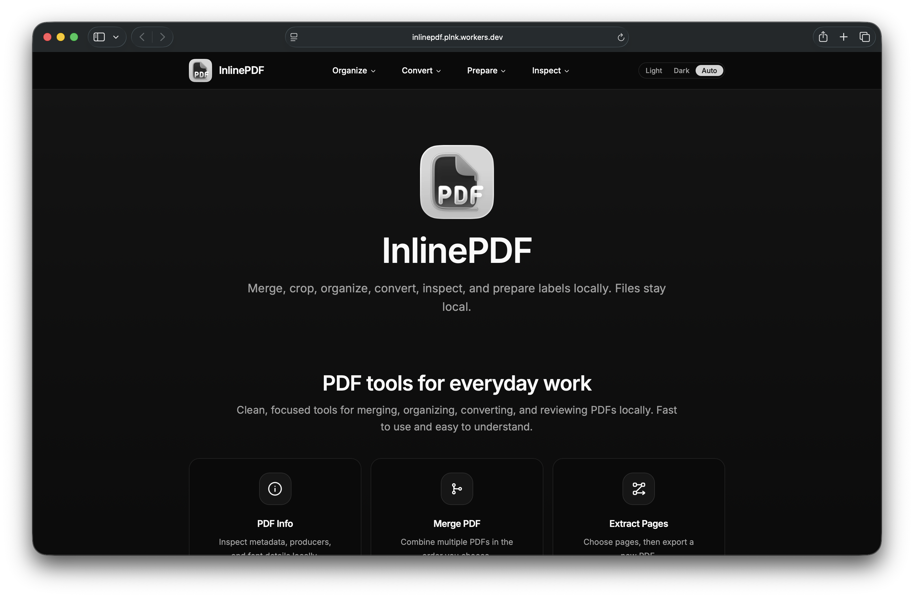

> [!WARNING]
> I no longer like to work with PDF files. Additionally, the ecosystem lacks a proper, up-to-date single PDF library to ensure future stability for a project of this scope. For an alternative, consider [BentoPDF](https://github.com/alam00000/bentopdf).

<p align="center">
  
</p>
<h1 align="center">InlinePDF</h1>

InlinePDF is a local-first PDF workspace for fast document operations without mandatory cloud upload.

Many PDF tools require server upload before merge, crop, extract, or conversion workflows can start. InlinePDF addresses that privacy and latency problem by running core file processing in the browser on local files. The result is a direct workflow for everyday PDF work, including retailer label preparation.



## What InlinePDF Does

### Core Tools

**Merge PDF** combines multiple PDFs in a selected order.  
**Extract Pages** creates a new PDF from selected pages.  
**Crop PDF** applies precise page-level cropping controls.  
**Image to PDF** combines JPG and PNG files into one PDF.  
**PDF to Images** exports pages as images in a ZIP archive.  
**PDF Info** inspects metadata, producer details, and font data locally.

### Retailer Label Workflows

InlinePDF includes dedicated shipping-label preparation for **Meesho Labels**, **Amazon Labels**, and **Flipkart Labels** from marketplace PDFs.

## What Is Unique

Document operations run in-browser instead of remote processing. The same product includes general-purpose PDF tools and retailer label workflows, so multiple document tasks stay in one local-first workspace. The architecture is modular, which keeps feature delivery focused and predictable.

## Benchmark

This benchmark uses one real retailer-label workflow so people can compare local-first performance quickly.

- **Input file:** `Meesho_784_pages.pdf`
- **File size:** `8.1 MB`
- **Pages:** `784`
- **Workflow:** `Meesho Labels`
- **Test condition:** SKU sorting was turned on for every run, including InlinePDF, E-LabelCrop, and PDF Cropper, to keep the comparison fair.

| Product | Processing location | Device or service | Outcome | Time | Evidence |
| --- | --- | --- | --- | --- | --- |
| InlinePDF | Local | MacBook Air M4 | Completed | `11s` | [Screenshot](./assets/readme/benchmark/meesho-labels-inlinepdf-macbook-air-m4.png) |
| InlinePDF | Local | Pixel 7a | Completed | `18s` | [Screenshot](./assets/readme/benchmark/meesho-labels-inlinepdf-pixel-7a.png) |
| InlinePDF | Local | realme 2 Pro | Completed | `42s` | [Screenshot](./assets/readme/benchmark/meesho-labels-inlinepdf-realme-2-pro.png) |
| E-LabelCrop | Cloud | `elabelcrop.com` | Completed | `40.50s` | [Screenshot](./assets/readme/benchmark/meesho-labels-elabelcrop.png) |
| PDF Cropper | Cloud | `pdfcropper.in` | Did not complete this file at the time of testing | N/A | [Screenshot](./assets/readme/benchmark/meesho-labels-pdfcropper.png) |

### Technical Notes

- These results suggest that this Meesho Labels workload depends more on processor performance than on RAM for this input size.
- The tested realme 2 Pro unit completed the job on the `4GB + 64GB` variant. According to the [realme 2 Pro tech specs](https://www.realme.com/global/realme2-pro/specs), that model uses a Qualcomm Snapdragon 660 AIE processor with an octa-core CPU.
- This does not mean RAM never matters. It suggests that `4GB` was sufficient for this `784`-page, `8.1 MB` benchmark and that the larger performance gap is more likely tied to processor class and JavaScript execution speed than RAM capacity alone.
- To match the benchmarked Chrome results, keep V8 optimization enabled. Google says V8 optimization is turned on by default to improve site performance. All benchmark runs in this section were performed with that setting enabled.
- On Chrome for desktop, the path is [Privacy and security > Security > Manage V8 security](https://support.google.com/chrome/answer/10468685?co=GENIE.Platform%3DDesktop&oco=1#zippy=%2Cmanage-v-security-settings), then select `Sites can use the V8 optimizer`.
- On Chrome for Android, open [Privacy and security > JavaScript optimization and security](https://support.google.com/chrome/answer/10468685?co=GENIE.Platform%3DAndroid&hl=en), and leave JavaScript optimization turned on.

This is a point-in-time comparison for a single file and workflow. Results vary by device performance, browser, thermal state, network conditions, and service load.

The cloud services in this comparison showed ads during testing. InlinePDF completed the same Meesho label workflow locally on each tested device.

## Build, Test, and Deploy

### Local Development

```bash
pnpm install
pnpm run dev
```

### Quality Gates

```bash
pnpm run lint
pnpm run typecheck
pnpm run build
pnpm run test
```

### Local Release Readiness

```bash
pnpm run verify
```

This command runs linting, type checks, tests, and build in sequence.

### Cloudflare Deploy

```bash
pnpm run deploy
```

`pnpm run build` generates Worker and static asset output under `build/`. `wrangler deploy` publishes the production Worker build. For staging, run `wrangler deploy --env staging` after build.

## License

InlinePDF is released under the MIT License.

### Acknowledgments

- **PDF.js:** PDF rendering and parsing are powered by Mozilla's `pdfjs-dist`. ([License](https://github.com/mozilla/pdf.js/blob/master/LICENSE))

- **pdf-lib:** PDF creation and document manipulation are powered by `pdf-lib`. ([License](https://github.com/Hopding/pdf-lib/blob/master/LICENSE.md))

- **React + React Router + Vite:** Application runtime and UI delivery are built with React, React Router, and Vite. ([License](https://github.com/facebook/react/blob/main/LICENSE), [License](https://github.com/remix-run/react-router/blob/main/LICENSE.md), [License](https://github.com/vitejs/vite/blob/main/LICENSE))

- **Tailwind CSS + shadcn/ui + Base UI:** Design system and component primitives are built with Tailwind CSS, shadcn, and Base UI. ([License](https://github.com/tailwindlabs/tailwindcss/blob/master/LICENSE), [License](https://github.com/shadcn-ui/ui/blob/main/LICENSE.md), [License](https://github.com/mui/base-ui/blob/master/LICENSE))

- **dnd-kit:** Drag-and-drop interactions for file and page workflows are powered by `@dnd-kit`. ([License](https://github.com/clauderic/dnd-kit/blob/master/LICENSE))

- **JSZip:** ZIP export workflows are powered by `jszip`. ([License](https://github.com/Stuk/jszip/blob/main/LICENSE.markdown))

- **Hugeicons:** Product iconography uses `@hugeicons/core-free-icons` and `@hugeicons/react`. ([License](https://github.com/hugeicons/hugeicons-react/blob/main/LICENSE))

- **Cloudflare Workers:** Deployment and edge delivery are hosted on Cloudflare Workers.
